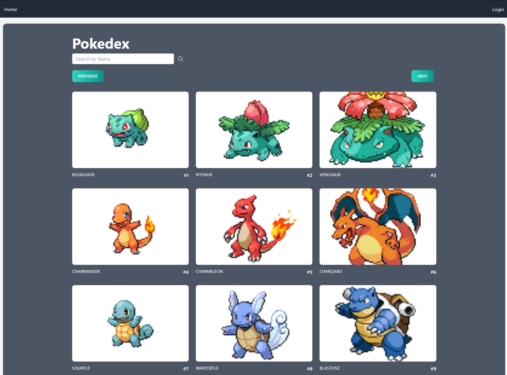
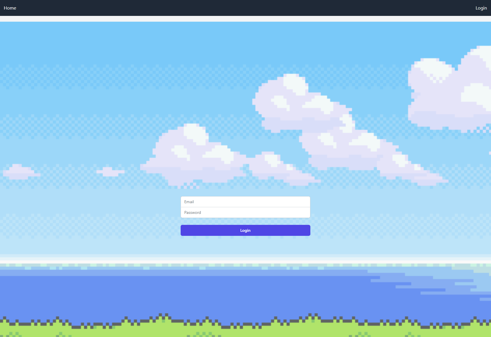
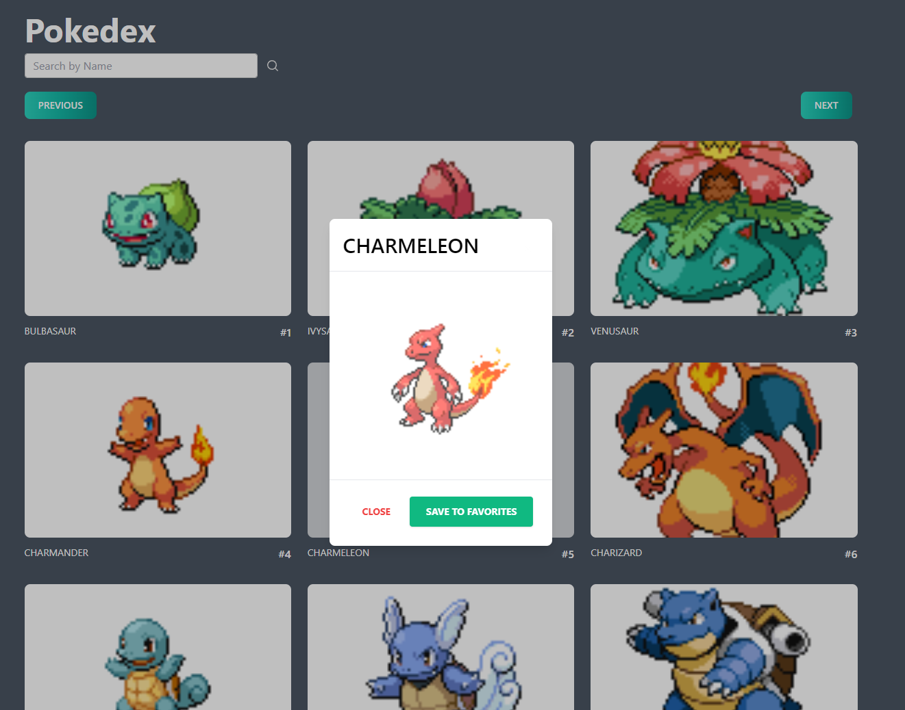
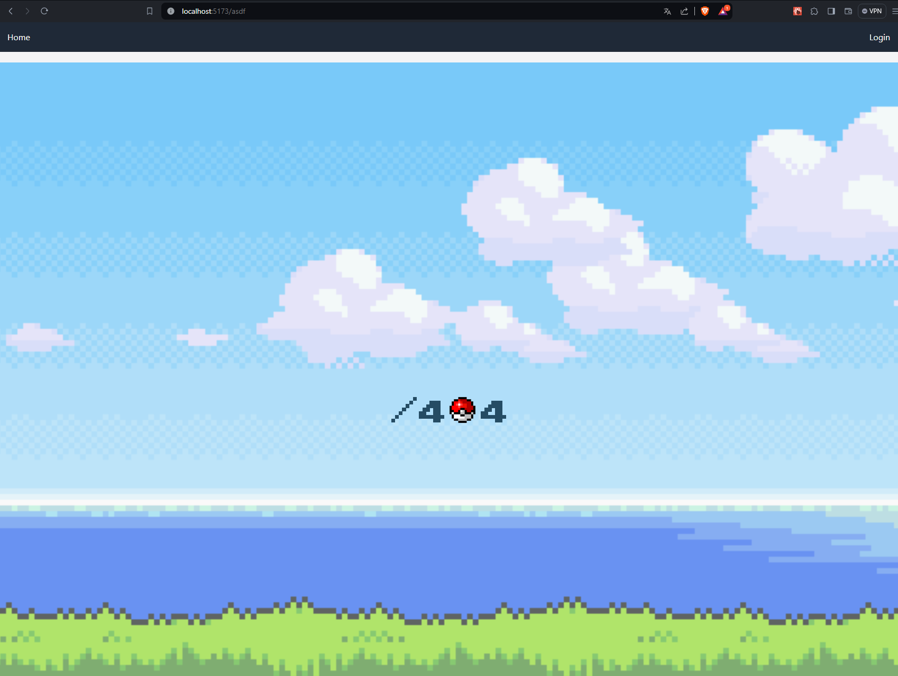
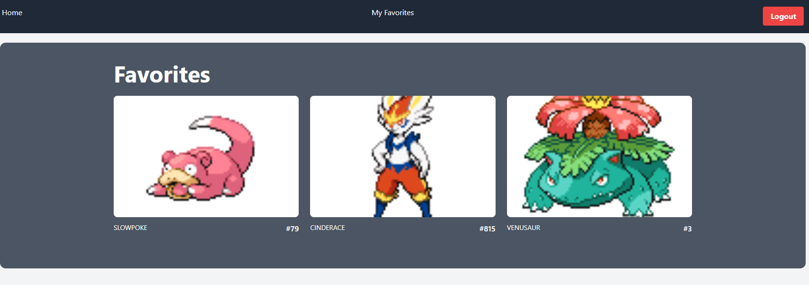
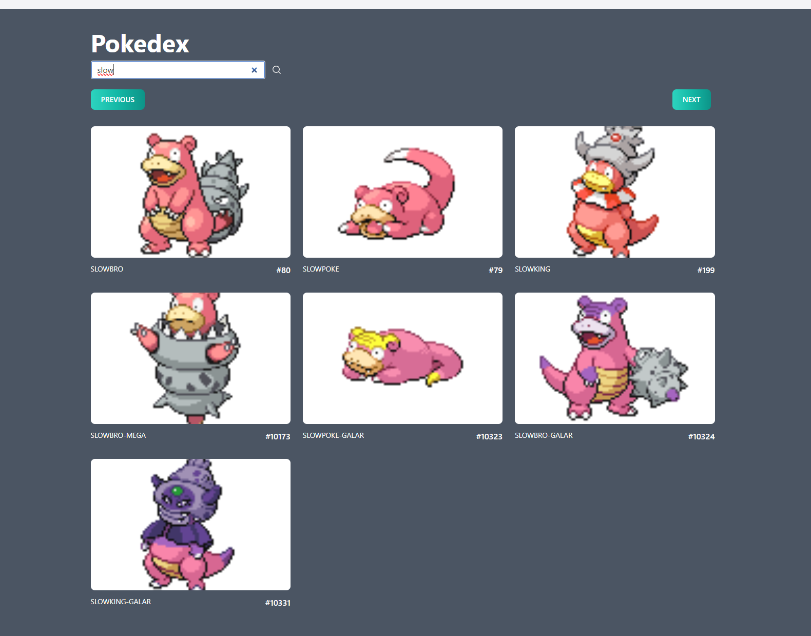

## Table of Contents
- [About the Project](#codemon-catcher)
- [Development Environment Preparation](#development-environment-preparation)
- [Local Database Setup](#local-database-setup)
- [Getting Started](#getting-started)
  - [Prerequisites](#prerequisites)
  - [Installation](#installation)
- [Running the Tests](#running-the-tests)
- [API Testing with Postman](#api-testing-with-postman)
- [Contributing](#contributing)
- [TODO](#todo)
- [License](#license)
- [Contact](#contact)
- [Acknowledgments](#acknowledgments)
- [Screenshots](#screenshots)


Codemon Catcher
---------------

**Codemon Catcher** is an interactive application designed for Pokémon enthusiasts, providing comprehensive access to all forms of each Pokémon, including their names and distinctive features. Users can create their own account to personalize their experience, allowing them to add Pokémon to a favorites list for quick and easy future reference. Additionally, the app facilitates Pokémon exploration with a pagination feature and a search tool by name, ensuring users can easily find their preferred Pokémon.

Developed with Node.js in the backend and React in the frontend, this project combines cutting-edge technologies to provide a smooth and responsive user experience. Whether you're looking for detailed information about your favorite Pokémon or just want to see what Pokémon are available, **Codemon Catcher** gives you the access and tools you need to dive into the world of Pokémon like never before.


Development Environment Preparation
-----------------------------------

You need to create an `.env` file at the root of the backend folder with the following environment variables required for your application's setup:

```
MONGO_DB=<Your_Local_MongoDB_Instance>
PORT=<Port_Where_Node.js_Will_Run>
JWT_SECRET=<Secret_For_Tokens_Creation>
```
* MONGO_DB: Specifies the connection string to your local or remote MongoDB database.
* PORT: Defines the port on which your Node.js server will run.
* JWT_SECRET: Provides a secret that will be used for signing and verifying JWT tokens for authentication.

Make sure to replace `<Your_Local_MongoDB_Instance>`, `<Port_Where_Node.js_Will_Run>`, and `<Secret_For_Tokens_Creation>` with your actual values without the less than and greater than signs.


Local Database Setup
--------------------

To get the most out of **Codemon Catcher** and have a customized experience, setting up a local database is necessary. This will allow you to access and manage Pokémon data directly from your development environment. The following steps will guide you through the setup process:

### 1\. **Setting Up PokeAPI Locally**

First, you'll need to run a local instance of PokeAPI. The quickest and easiest way to do this is using Docker. Detailed instructions for setting up this instance can be found in the [official PokeAPI GitHub repository](https://github.com/PokeAPI/pokeapi). Follow the instructions for the Docker setup.

### 2\. **Running the Data Copy Script**

Once you have the PokeAPI instance running locally, the next step is to populate your database with Pokémon data. Within the "backend" folder of **Codemon Catcher**, execute the following command:


`npm run refresh-db`

This command will run a script designed to copy data from the local instance of PokeAPI into your database, ensuring you have access to the latest Pokémon information for your application.


Getting Started
---------------

These instructions will get you a copy of the project up and running on your local machine for development and testing purposes. Follow these simple steps to set up **Codemon Catcher**.

### Prerequisites

Before starting, make sure you have Node.js and npm installed on your system. These are essential for running the **Codemon Catcher** server and client. You can verify their installation with the following commands:

`node --version npm --version`

### Installation

1.  **Clone the repository**
    
    First, clone the **Codemon Catcher** repository to your local machine using git:
    
    `git clone https://github.com/EdgarPsda/codemon-catcher.git cd codemon-catcher`
    
2.  **Install the dependencies**
    
    Inside the project (backend and frontend) directory, install the necessary dependencies:
    
    `npm install`
    
3.  **Start the server**
    
    Run the following command in backend directory to start the backend server:
    
    `npm run start`
    
    This command will start the server on `http://localhost:4000`.
    
4.  **Start the React application**
    
    In a new terminal run the following command in frontend directory to start the frontend application:
    
    `npm run start`
    
    The React application should now be accessible at `http://localhost:5173/`.
    

Running the Tests
-----------------

To run the automated tests for this system, use the following command in `/backend` and `/frontend` directories:

`npm test`

This will execute the configured test suite and display the results.

API Testing with Postman
------------------------

To facilitate the testing and exploration of **Codemon Catcher**'s APIs, I have prepared a Postman collection containing all the configured requests to interact with the API. Postman is a powerful tool that allows developers and testers to send HTTP requests and view responses in real-time, simplifying the API testing process.

### How to Use the Postman Collection

1.  **Download Postman**: If you don't already have Postman installed, you can download it from the official Postman website.
    
2.  **Import the Collection**: Download the provided Postman collection from the following link:
    
    [Download Postman Collection](https://api.postman.com/collections/7036251-b68bc5d6-5012-4578-afdf-d442b431436a?access_key=PMAT-01HNXGB8PBBCRBYMPN41PMT71C)
    
    Once downloaded, you can import the collection into Postman using the "Import" button in the top left corner of the application.
    
3.  **Configure Environment Variables**: Make sure to set up the necessary environment variables in Postman to point to your local or remote instance of **Codemon Catcher**. This might include the API base URL, authentication tokens, or any other relevant variables.
    
4.  **Explore and Test**: With the collection imported and environment variables set, you are ready to explore the APIs. Select a request from the collection and click the "Send" button to make the request to the API and view the response.
    

This Postman collection will allow you to quickly test the functionalities of **Codemon Catcher**, including account creation, login, Pokémon search, and much more.


## Contributing

Contributions are what make the open-source community such an amazing place to learn, inspire, and create. Any contributions you make are **greatly appreciated**.

If you have a suggestion that would make this better, please fork the repo and create a pull request. You can also simply open an issue with the tag "enhancement".
Don't forget to give the project a star! Thanks again!


TODO
----

Below is a list of features and improvements planned for **Codemon Catcher**. We are constantly looking to enhance the application and value any contributions that help achieve these goals:

**Frontend Authentication APIs Implementation**: Currently, the backend supports the login flow, authentication, confirmation, and user creation, but these functionalities are not yet implemented in the frontend of Codemon Catcher.
    
**Full User Integration**: Allow users to register, log in, and manage their accounts directly from the Codemon Catcher user interface.
    
**Favorites Functionality Expansion**: Improve how users can add, view, and manage their favorite Pokémon.
    
**Internationalization**: Add multilingual support to make Codemon Catcher accessible to a global audience.
    

## License

Distributed under the MIT License. See `LICENSE` for more information.


## Contact

Project Link: [https://github.com/EdgarPsda/codemon-catcher](https://github.com/EdgarPsda/codemon-catcher)


## Acknowledgments

- [PokeAPI](https://pokeapi.co/)
- [Node.js](https://nodejs.org/)
- [React](https://reactjs.org/)
- Everyone who contributed to the project!

## Screenshots







